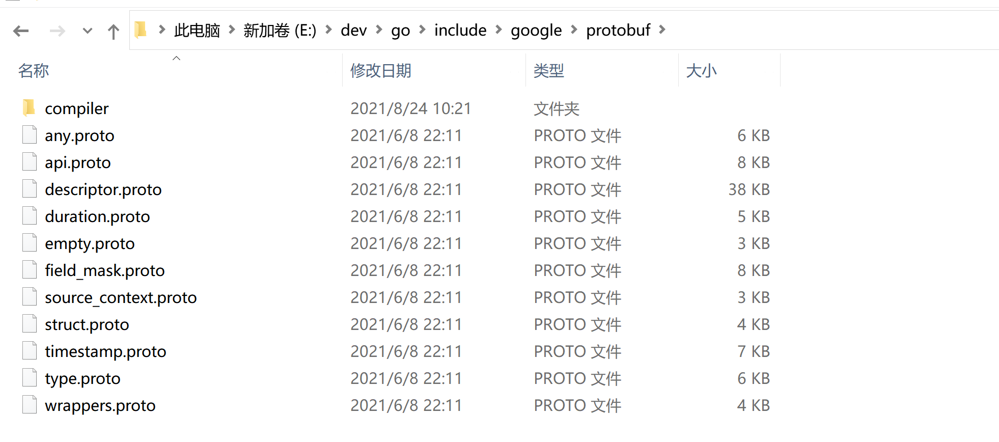

# rpc+grpc入门

## rpc

### 什么是RPC

远程过程调用（Remote Procedure Call，缩写为 RPC）是一个计算机通信协议。 该协议允许运行于一台计算机的程序调用另一台计算机的子程序，而程序员无需额外地为这个交互作用编程。 如果涉及的软件采用面向对象编程，那么远程过程调用亦可称作远程调用或远程方法调用


### helloword-rpc 案例

server.go

```go
package main

import (
	"net"
	"net/rpc"
)

type HelloService struct{}

func (s *HelloService) Hello(request string, reply *string) error {
	//返回值是通过修改reply的值
	*reply = "hello, " + request
	return nil
}

func main() {
	//1. 实例化一个server
	listener, _ := net.Listen("tcp", "127.0.0.1:1234")
	//2. 注册处理逻辑 handler
	_ = rpc.RegisterName("HelloService", &HelloService{})
	//3. 启动服务
	conn, _ := listener.Accept() //当一个新的连接进来的时候，
	rpc.ServeConn(conn)
}

```


client.go

```go
package main

import (
	"fmt"
	"net/rpc"
)

func main() {
	//1. 建立连接
	client, err := rpc.Dial("tcp", "127.0.0.1:1234")
	if err != nil {
		panic("连接失败")
	}
	var reply string //string有默认值
	err = client.Call("HelloService.Hello", "golang", &reply)
	if err != nil {
		panic("调用失败")
	}
	fmt.Println(reply)
}

```


### rpc的序列化协议为json

server.go

```go
package main

import (
	"net"
	"net/rpc"
	"net/rpc/jsonrpc"
)

type HelloService struct{}

func (s *HelloService) Hello(request string, reply *string) error {
	//返回值是通过修改reply的值
	*reply = "hello, " + request
	return nil
}

func main() {
	//1. 实例化一个server
	listener, _ := net.Listen("tcp", "127.0.0.1:1234")
	//2. 注册处理逻辑 handler
	_ = rpc.RegisterName("HelloService", &HelloService{})
	//3. 启动服务
	for {
		conn, _ := listener.Accept() //当一个新的连接进来的时候，
		go rpc.ServeCodec(jsonrpc.NewServerCodec(conn))
	}
}

```


client.go

```go
package main

import (
	"fmt"
	"net"
	"net/rpc"
	"net/rpc/jsonrpc"
)

func main() {
	//1. 建立连接
	conn, err := net.Dial("tcp", "127.0.0.1:1234")
	if err != nil {
		panic("连接失败")
	}
	var reply string //string有默认值
	client := rpc.NewClientWithCodec(jsonrpc.NewClientCodec(conn))
	err = client.Call("HelloService.Hello", "golang", &reply)
	if err != nil {
		panic("调用失败")
	}
	fmt.Println(reply)
}

```


### rpc的传输协议为http

将rpc的传输协议修改为http来处理

server.go

```go
package main

import (
	"io"
	"net/http"
	"net/rpc"
	"net/rpc/jsonrpc"
)


type HelloService struct{}

func (s *HelloService) Hello(request string, reply *string) error {
	//返回值是通过修改reply的值
	*reply = "hello, " + request
	return nil
}

func main() {
	_ = rpc.RegisterName("HelloService", &HelloService{})

	http.HandleFunc("/jsonrpc", func(w http.ResponseWriter, r *http.Request) {
		var conn io.ReadWriteCloser = struct {
			io.Writer
			io.ReadCloser
		}{
			ReadCloser: r.Body,
			Writer:     w,
		}
		_ =rpc.ServeRequest(jsonrpc.NewServerCodec(conn))
	})

	_ = http.ListenAndServe("127.0.0.1:1234", nil)
}

```


postman

```
127.0.0.1:1234/jsonrpc

{
	"id" : 0,
	"params" : ["golang"],
	"method" : "HelloService.Hello"
}
```


client.go

```go
package main

import (
	"bytes"
	"encoding/json"
	"fmt"
	"io/ioutil"
	"net/http"
)

type Res struct {
	Id int
	Result string
	Error error
}

func main() {
	bodyReader := `{
	"id" : 0,
	"params" : ["golang"],
	"method" : "HelloService.Hello"
}`

	req, err := http.NewRequest("post","http://127.0.0.1:1234/jsonrpc", bytes.NewBufferString(bodyReader))
	if err != nil {
		panic(err)
	}
	req.Header.Set("Content-Type", "application/json;charset=UTF-8")

	res, err := http.DefaultClient.Do(req)
	if err != nil {
		panic(err)
	}

	defer res.Body.Close()

	resBytes, err := ioutil.ReadAll(res.Body)

	if err != nil {
		panic(err)
	}

	resApi := Res{}
	err = json.Unmarshal(resBytes, &resApi)
	if err != nil {
		panic(err)
	}

	fmt.Println(resApi)
	fmt.Println("============")

	json , _ := json.Marshal(resApi)
	fmt.Println(string(json))
}

```


## grpc

### 什么是grpc

gRPC 是一个高性能、开源和通用的 RPC 框架，面向移动和 HTTP/2 设计。目前提供 C、Java 和 Go 语言版本，分别是：[grpc](https://github.com/grpc/grpc), [grpc-java](https://github.com/grpc/grpc-java), [grpc-go](https://github.com/grpc/grpc-go). 其中 C 版本支持 [C](https://github.com/grpc/grpc), [C++](https://github.com/grpc/grpc/tree/master/src/cpp), [Node.js](https://github.com/grpc/grpc/tree/master/src/node), [Python](https://github.com/grpc/grpc/tree/master/src/python), [Ruby](https://github.com/grpc/grpc/tree/master/src/ruby), [Objective-C](https://github.com/grpc/grpc/tree/master/src/objective-c), [PHP](https://github.com/grpc/grpc/tree/master/src/php) 和 [C#](https://github.com/grpc/grpc/tree/master/src/csharp) 支持.

官方：https://github.com/grpc/grpc


### 什么是protobuf

- `Protocol Buffer` 其实 是 `Google`出品的一种轻量 & 高效的结构化数据存储格式，性能比 `Json、XML` 真的强！太！多！
- protobuf经历了protobuf2和protobuf3，pb3比pb2简化了很多，目前主流的版本是pb3


### go下的grpc环境

#### 安装 protobuf

1.下载地址：https://github.com/protocolbuffers/protobuf/releases

根据自身电脑的操作系统，选择最新的releases版本下载

 

2.解压后在bin目录找到protoc.exe，然后把它复制到GOBIN目录下

> 一般操作是把protoc.exe所在的目录配到环境变量里，这里直接把protoc.exe复制到GOBIN目录下，前提是环境变量已经配置了GOBIN环境变量。

3.打开cmd，运行`protoc --version`

成功打印当前版本信息证明安装成功了。

#### 安装相关包

安装 golang 的proto工具包

```shell
go get -u github.com/golang/protobuf/proto
```

安装 goalng 的proto编译支持

```shell
go get -u github.com/golang/protobuf/protoc-gen-go

# 这里在win环境，需要将gopath里生成的 
# E:\web\go_work\wingopath\bin\protoc-gen-go.exe
# 拷贝到, go的bin目录下
# E:\dev\go\bin
```

安装 gRPC 包

```
go get -u google.golang.org/grpc
```


#### proto文件

```protobuf
syntax = "proto3";
option go_package = ".;proto";
service Greeter {
  rpc SayHello (HelloRequest) returns (HelloReply);
}

message HelloRequest {
  string name = 1;
}

message HelloReply {
  string message = 1;
}
```


#### 生成go文件

```
protoc -I . helloworld.proto --go_out=plugins=grpc:.
```


#### 服务端代码

```go
package main

import (
    "context"
    "fmt"
    "google.golang.org/grpc"
    "grpc_demo/hello"
    "net"
)

type Server struct {
}


func (s *Server)  SayHello(ctx context.Context,request *hello.HelloRequest)(*hello.HelloReply,error){
    return &hello.HelloReply{Message:"Hello "+request.Name},nil
}

func main()  {
    g := grpc.NewServer()
    s := Server{}
    hello.RegisterGreeterServer(g,&s)
    lis, err := net.Listen("tcp", fmt.Sprintf(":8080"))
    if err != nil {
        panic("failed to listen: "+err.Error())
    }
    g.Serve(lis)
}
```

#### 客户端代码

```go
package main

import (
    "context"
    "fmt"
    "google.golang.org/grpc"
    "grpc_demo/proto"
)

func main()  {
    conn,err := grpc.Dial("127.0.0.1:8080",grpc.WithInsecure())
    if err!=nil{
        panic(err)
    }
    defer conn.Close()
    c := hello.NewGreeterClient(conn)
    r,err := c.SayHello(context.Background(),&hello.HelloRequest{Name:"bobby"})
    if err!=nil{
        panic(err)
    }
    fmt.Println(r.Message)
}
```


### golang配置protobuf插件

下载地址：https://github.com/ksprojects/protobuf-jetbrains-plugin/releases

将下载的文件放置在一个目录下保存起来；goland引入

选择 Install Plugins from disk，导入即可。不用解压zip包

 


### grpc 快速入门

01-helloword/proto/helloworld.proto

```protobuf
syntax = "proto3";
option go_package = ".;proto";
service Greeter {
    rpc SayHello (HelloRequest) returns (HelloReply);
}
message HelloRequest {
    string name = 1;
}

message HelloReply {
    string message = 1;
}
```


```
protoc --go_out=plugins=grpc:./ ./helloworld.proto
```


01-helloword/server/server.go

```go
package main

import (
	"context"
	"google.golang.org/grpc"
	"net"

	"test-google-micro-service/02-grpc/01-helloword/proto"
)

type Server struct{}

func (s *Server) SayHello(ctx context.Context, req *proto.HelloRequest) (*proto.HelloReply, error) {
	return &proto.HelloReply{
		Message: "hello, " + req.Name,
	}, nil
}

func main() {
	g := grpc.NewServer()

	proto.RegisterGreeterServer(g, &Server{})

	Listener, _ := net.Listen("tcp", "0.0.0.0:8080")

	_ = g.Serve(Listener)
}

```


01-helloword/client/client.go

```go
package main

import (
	"context"
	"fmt"
	"google.golang.org/grpc"
	"test-google-micro-service/02-grpc/01-helloword/proto"
)

func main() {
	conn, _ := grpc.Dial("127.0.0.1:8080", grpc.WithInsecure())

	defer conn.Close()

	c := proto.NewGreeterClient(conn)
	rsp, _ :=c.SayHello(context.Background(),
		&proto.HelloRequest{Name:"golang"},
	)

	fmt.Println(rsp.Message)
}

```


## grpc四种数据流

### 简单模式

参考：快速入门


### 服务端数据流模式

场景：服务端把股票代码的实时数据推到客户端

```
syntax = "proto3";

option go_package = ".;proto";

service Greeter {
    rpc GetStream (StreamReqData) returns (stream StreamResData); // 服务端流模式
}

message StreamReqData {
    string data = 1;
}

message StreamResData {
    string data = 1;
}
```


server.go

```go
package main

import (
	"fmt"
	"net"
	"time"

	"google.golang.org/grpc"

	"test-google-micro-service/02-grpc/02-stream/proto"
)

const PORT = ":50052"

type server struct {}

// 服务器流
func (s *server) GetStream(req *proto.StreamReqData, res proto.Greeter_GetStreamServer) error {
	i := 0
	for {
		i++

		_ = res.Send(&proto.StreamResData{
			Data: fmt.Sprintf("%v", time.Now().Unix()),
		})
		time.Sleep(time.Second)

		if i > 10 {
			break
		}
	}

	return nil
}


func main() {
	listener, _ := net.Listen("tcp", PORT)
	s := grpc.NewServer()

	proto.RegisterGreeterServer(s, &server{})
	err := s.Serve(listener)

	if err != nil {
		panic(err)
	}
}

```

client.go

```go
package main

import (
	"context"
	"fmt"

	"google.golang.org/grpc"

	"test-google-micro-service/02-grpc/02-stream/proto"
)

func main() {
	conn, err := grpc.Dial("127.0.0.1:50052", grpc.WithInsecure())
	if err != nil {
		panic(err)
	}

	defer conn.Close()

	// 服务端流模式
	c := proto.NewGreeterClient(conn)
	res, _ := c.GetStream(context.Background(), &proto.StreamReqData{Data: "慕课网"})
	for {
		a, err := res.Recv()
		if err != nil {
			fmt.Println(err)
			break
		}
		fmt.Println(a.Data)
	}
}

```


### 客户端数据流模式

场景：客户端源源不断的向服务端提交数据，比如上传客户的定位的数据

```
syntax = "proto3";

option go_package = ".;proto";

service Greeter {
    rpc PutStream (stream StreamReqData) returns (StreamResData); // 客户端流模式
}

message StreamReqData {
    string data = 1;
}

message StreamResData {
    string data = 1;
}
```

server.go

```go
package main

import (
	"fmt"
	"net"
	"time"

	"google.golang.org/grpc"

	"test-google-micro-service/02-grpc/02-stream/proto"
)

const PORT = ":50052"

type server struct {}

func (s *server) PutStream(cliStr proto.Greeter_PutStreamServer) error {
	for {
		if data, err := cliStr.Recv(); err != nil {
			fmt.Println(err)
			break
		} else {
			fmt.Println(data.Data)
		}
	}

	return nil
}

func (s *server) AllStream(proto.Greeter_AllStreamServer) error{
	return nil
}

func main() {
	listener, _ := net.Listen("tcp", PORT)
	s := grpc.NewServer()

	proto.RegisterGreeterServer(s, &server{})
	err := s.Serve(listener)

	if err != nil {
		panic(err)
	}
}

```

client.go

```go
package main

import (
	"context"
	"fmt"
	"time"

	"google.golang.org/grpc"

	"test-google-micro-service/02-grpc/02-stream/proto"
)

func main() {
	conn, err := grpc.Dial("127.0.0.1:50052", grpc.WithInsecure())
	if err != nil {
		panic(err)
	}

	defer conn.Close()

	c := proto.NewGreeterClient(conn)

	//客户端流模式
	putS, _ := c.PutStream(context.Background())
	i := 0
	for {
		i++
		putS.Send(&proto.StreamReqData{
			Data: fmt.Sprintf("慕课网%d", i),
		})

		time.Sleep(time.Second)
		if i > 10 {
			break
		}
	}
}

```


### 双向流模式

场景：客户端和服务端双向聊天


proto

```protobuf
syntax = "proto3";

option go_package = ".;proto";

service Greeter {
    rpc AllStream (stream StreamReqData) returns(stream StreamResData); // 双向流模式
}

message StreamReqData {
    string data = 1;
}

message StreamResData {
    string data = 1;
}
```


server.go

```go
package main

import (
	"fmt"
	"net"
	"sync"
	"time"

	"google.golang.org/grpc"

	"test-google-micro-service/02-grpc/02-stream/proto"
)

const PORT = ":50052"

type server struct {}

func (s *server) AllStream(allStr proto.Greeter_AllStreamServer) error{
	wg := sync.WaitGroup{}

	wg.Add(2)

	go func() {
		defer wg.Done()
		for {
			data, _ := allStr.Recv()
			fmt.Println("收到客户端的消息:" + data.Data)
		}
	}()

	go func() {
		defer wg.Done()
		for {
			_ = allStr.Send(&proto.StreamResData{
				Data: "我是服务器",
			})
			time.Sleep(time.Second)
		}
	}()

	wg.Wait()

	return nil
}

func main() {
	listener, _ := net.Listen("tcp", PORT)
	s := grpc.NewServer()

	proto.RegisterGreeterServer(s, &server{})
	err := s.Serve(listener)

	if err != nil {
		panic(err)
	}
}

```

client.go

```go
package main

import (
	"context"
	"fmt"
	"sync"
	"time"

	"google.golang.org/grpc"

	"test-google-micro-service/02-grpc/02-stream/proto"
)

func main() {
	conn, err := grpc.Dial("127.0.0.1:50052", grpc.WithInsecure())
	if err != nil {
		panic(err)
	}

	defer conn.Close()

	c := proto.NewGreeterClient(conn)

	//双向流模式
	wg := sync.WaitGroup{}
	allStr, _ := c.AllStream(context.Background())

	wg.Add(2)

	go func() {
		defer wg.Done()
		for {
			data, _ := allStr.Recv()
			fmt.Println("收到服务端消息：" + data.Data)
		}
	}()

	go func() {
		defer wg.Done()
		for {
			_ = allStr.Send(&proto.StreamReqData{Data: "慕课网"})
			time.Sleep(time.Second)
		}
	}()

	wg.Wait()
}

```


## grpc和protobuf进阶

### protobuf的基本类型和默认值

**标量数值类型**

一个标量消息字段可以含有一个如下的类型——该表格展示了定义于.proto文件中的类型，以及与之对应的、在自动生成的访问类中定义的类型：

| .proto Type | Notes                                                        | Python Type | Go Type |
| ----------- | ------------------------------------------------------------ | ----------- | ------- |
| double      |                                                              | float       | float64 |
| float       |                                                              | float       | float32 |
| int32       | 使用变长编码，对于负值的效率很低，如果你的域有可能有负值，请使用sint64替代 | int         | int32   |
| uint32      | 使用变长编码                                                 | int         | uint32  |
| uint64      | 使用变长编码                                                 | int         | uint64  |
| sint32      | 使用变长编码，这些编码在负值时比int32高效的多                | int         | int32   |
| sint64      | 使用变长编码，有符号的整型值。编码时比通常的int64高效。      | int         | int64   |
| fixed32     | 总是4个字节，如果数值总是比总是比228大的话，这个类型会比uint32高效。 | int         | uint32  |
| fixed64     | 总是8个字节，如果数值总是比总是比256大的话，这个类型会比uint64高效。 | int         | uint64  |
| sfixed32    | 总是4个字节                                                  | int         | int32   |
| sfixed64    | 总是8个字节                                                  | int         | int64   |
| bool        |                                                              | bool        | bool    |
| string      | 一个字符串必须是UTF-8编码或者7-bit ASCII编码的文本。         | str         | string  |
| bytes       | 可能包含任意顺序的字节数据。                                 | str         | []byte  |

**默认值**

当一个消息被解析的时候，如果被编码的信息不包含一个特定的singular元素，被解析的对象锁对应的域被设置位一个默认值，对于不同类型指定如下：

- 对于strings，默认是一个空string
- 对于bytes，默认是一个空的bytes

- 对于bools，默认是false
- 对于数值类型，默认是0

- 对于枚举，默认是第一个定义的枚举值，必须为0;
- 对于消息类型（message），域没有被设置，确切的消息是根据语言确定的，详见[generated code guide](https://developers.google.com/protocol-buffers/docs/reference/overview?hl=zh-cn)
  对于可重复域的默认值是空（通常情况下是对应语言中空列表）。
  注：对于标量消息域，一旦消息被解析，就无法判断域释放被设置为默认值（例如，例如boolean值是否被设置为false）还是根本没有被设置。你应该在定义你的消息类型时非常注意。例如，比如你不应该定义boolean的默认值false作为任何行为的触发方式。也应该注意如果一个标量消息域被设置为标志位，这个值不应该被序列化传输。


### option  go_package 作用

如 option  go_package="./common/proto/v1;v1"; 表示将文件生成在当前proto文件下的/common/proto/v1中 且包名为 v1（对go有效），有利于包管理 

 

 


### proto文件引入其他proto文件 

base.proto

```protobuf
syntax = "proto3";
option go_package = ".;proto";

message Empty {
    string name = 1;
}

message Pong {
    string name = 1;
}
```

hello.proto

```protobuf
syntax = "proto3";
option go_package = ".;proto";
import "base.proto";

service Greeter{
    rpc SayHello(HelloRequest) returns (HelloReply){}
    rpc Ping(Empty) returns(Pong){}
}

message HelloRequest{
    string name =1;
    repeated int32 id = 2;
}

message HelloReply{
    string message = 1;
}
```

```shell
# 生成go文件
protoc --go_out=plugins=grpc:./ ./base.proto
protoc --go_out=plugins=grpc:./ ./hello.proto
```

server.go

```go
package main

import (
	"context"
	"fmt"
	"google.golang.org/grpc"
	"net"

	"test-google-micro-service/02-grpc/03-proto-import/proto"
)

type Server struct{}

func (s *Server) SayHello(ctx context.Context, req *proto.HelloRequest) (*proto.HelloReply, error) {
	return &proto.HelloReply{
		Message: fmt.Sprintf("name is %s id is %v", req.Name, req.Id),
	}, nil
}

func (s *Server) Ping(ctx context.Context, res *proto.Empty) (resp *proto.Pong, err error) {
	return &proto.Pong{
		Name: fmt.Sprintf("pong name is %s", res.Name),
	}, nil
}

func main() {
	g := grpc.NewServer()
	proto.RegisterGreeterServer(g, &Server{})
	listener, err := net.Listen("tcp", fmt.Sprintf(":8080"))
	if err != nil {
		panic("failed to listen" + err.Error())
	}
	_ = g.Serve(listener)
}
```

client.go

```go
package main

import (
	"context"
	"fmt"

	"google.golang.org/grpc"

	"test-google-micro-service/02-grpc/03-proto-import/proto"
)

func main() {
	conn, err := grpc.Dial("127.0.0.1:8080", grpc.WithInsecure())
	if err != nil {
		panic("net.Dial err " + err.Error())
	}

	client := proto.NewGreeterClient(conn)

	reply, err := client.SayHello(context.Background(), &proto.HelloRequest{Name: "hello name", Id: []int32{1, 2, 3}})
	if err != nil {
		panic(err)
	}
	fmt.Println(reply.Message)

	pong, err := client.Ping(context.Background(), &proto.Empty{Name: "empty name"})
	if err != nil {
		panic(err)
	}
	fmt.Println(pong)

	defer conn.Close()
}
```


### message 嵌套

#### 直接嵌套在message里面 

proto

```protobuf
syntax = "proto3";
option  go_package=".;proto";

service Greeter {
    rpc SayHello(HelloRequest) returns (HelloReply) {}
}

message HelloRequest {
    string name = 1;
    repeated int32 id = 2;
}

message HelloReply {
    string message = 1;
    message Result {
        string code = 1;
        string msg = 2;
    }
    repeated Result data = 2;
}

```

```
protoc --go_out=plugins=grpc:./ ./hello.proto
```

server.go

```go
package main

import (
	"context"
	"fmt"
	"net"

	"google.golang.org/grpc"

	"test-google-micro-service/02-grpc/04-proto-message/proto"
)

type Server struct {
}

func (s *Server) SayHello(ct context.Context, req *proto.HelloRequest) (resp *proto.HelloReply, err error) {
	rs := []*proto.HelloReply_Result{
		&proto.HelloReply_Result{Code: "11", Msg: "success"},
		&proto.HelloReply_Result{Code: "22", Msg: "fail"},
	}
	return &proto.HelloReply{
		Message: fmt.Sprintf("name is %s", req.Name),
		Data:    rs,
	}, nil
}

func main() {
	g := grpc.NewServer()
	proto.RegisterGreeterServer(g, &Server{})
	listener, err := net.Listen("tcp", "0.0.0.0:8080")
	if err != nil {
		panic("net.Listen err " + err.Error())
	}

	_ = g.Serve(listener)
}
```


client.go

```go
package main

import (
	"context"
	"fmt"
	"google.golang.org/grpc"
	"test-google-micro-service/02-grpc/04-proto-message/proto"
)

func main () {
	conn, err := grpc.Dial("127.0.0.7:8080", grpc.WithInsecure())
	if err != nil {
		panic("grpc.Dial err" + err.Error())
	}

	client := proto.NewGreeterClient(conn)
	reply, err := client.SayHello(context.Background(), &proto.HelloRequest{Name: "hello golang", Id: []int32{11, 22}})
	if err != nil {
		panic(err)
	}

	fmt.Println(reply.Message)
	fmt.Println(reply.Data)

	defer conn.Close()
}
```


#### 数据类型在message之外

proto

```protobuf
syntax = "proto3";
option  go_package = ".;proto";

service Greeter{
    rpc SayHello(HelloRequest) returns (HelloReply){}
}

message HelloRequest{
    string name = 1;
    repeated int32 id = 2;
}

message Result {
    string code = 1;
    string msg = 2;
}

message HelloReply{
    string message = 1;
    repeated Result data = 2;
}
```

server.go

```go
package main

import (
	"context"
	"fmt"
	"net"

	"google.golang.org/grpc"

	"test-google-micro-service/02-grpc/05-proto-message-out/proto"
)

type Server struct {

}

func (this *Server) SayHello(ctx context.Context,res *proto.HelloRequest)(resp *proto.HelloReply,err error){
	rs:=[]*proto.Result{
		&proto.Result{Code: "11",Msg: "success"},
		&proto.Result{Code: "00",Msg: "fail"},
	}
	return &proto.HelloReply{
		Message: fmt.Sprintf("name is %s",res.Name),
		Data: rs,
	},nil
}

func main()  {
	g:=grpc.NewServer()
	s := Server{}
	proto.RegisterGreeterServer(g,&s)
	lis, err := net.Listen("tcp", fmt.Sprintf(":8080"))
	if err != nil {
		panic("failed to listen: "+err.Error())
	}

	g.Serve(lis)
}
```

client.go

```go
package main
import (
	"context"
	"fmt"

	"google.golang.org/grpc"

	"test-google-micro-service/02-grpc/05-proto-message-out/proto"
)
func main()  {
	conn,err:=grpc.Dial("127.0.0.1:8080",grpc.WithInsecure())
	if err!=nil {
		fmt.Println("net.Dial err"+err.Error())
	}
	c := proto.NewGreeterClient(conn)

	r,err := c.SayHello(context.Background(),&proto.HelloRequest{Name:"hello name",Id: []int32{1,2,3}})

	if err!=nil{
		panic(err)
	}
	fmt.Println(r.Message)
	fmt.Println(r.Data)

	defer conn.Close()
}
```


### enum 枚举类型 

proto

```protobuf
syntax = "proto3";
option  go_package = ".;proto";

service Greeter{
    rpc SayHello(HelloRequest) returns (HelloReply){}
}

enum Gender {
    Male = 0;
    Female = 1;
}

message HelloRequest{
    string name = 1;
    repeated int32 id = 2;
    Gender sex = 3;
}

message Result {
    string code = 1;
    string msg = 2;
}

message HelloReply{
    string message = 1;
    repeated Result data = 2;
}
```

server.go

```go
package main

import (
	"context"
	"fmt"
	"net"

	"google.golang.org/grpc"

	"test-google-micro-service/02-grpc/06-proto-enum/proto"
)

type Server struct {
}

func (s *Server) SayHello(ct context.Context, req *proto.HelloRequest) (*proto.HelloReply, error) {
	rs := []*proto.Result{
		&proto.Result{Code: "11", Msg: "success"},
		&proto.Result{Code: "00", Msg: "fail"},
	}

	fmt.Println(fmt.Sprintf("Gender is %v", req.Sex))

	return &proto.HelloReply{
		Message: "hello " + req.Name,
		Data:    rs,
	}, nil
}

func main() {
	g := grpc.NewServer()
	s := Server{}
	proto.RegisterGreeterServer(g, &s)
	lis, err := net.Listen("tcp", fmt.Sprintf(":8080"))
	if err != nil {
		panic("failed to listen: " + err.Error())
	}
	g.Serve(lis)
}

```

client.go

```go
package main

import (
	"context"
	"fmt"
	"google.golang.org/grpc"

	"test-google-micro-service/02-grpc/06-proto-enum/proto"
)

func main() {
	conn, err := grpc.Dial("127.0.0.1:8080", grpc.WithInsecure())
	if err != nil {
		fmt.Println("net.Dial err" + err.Error())
	}
	c := proto.NewGreeterClient(conn)

	r, err := c.SayHello(context.Background(),
		&proto.HelloRequest{Name: "hello name",
			Id: []int32{1, 2, 3}, Sex: proto.Gender_Female})

	if err != nil {
		panic(err)
	}
	fmt.Println(r.Message)
	fmt.Println(r.Data)

	defer conn.Close()
}

```


### map 类型 

proto

```protobuf
syntax = "proto3";
option  go_package = ".;proto";

service Greeter{
    rpc SayHello(HelloRequest) returns (HelloReply){}
}

message HelloRequest{
    string name = 1;
    repeated int32 id = 2;
    map<string,string> mp = 3;
}

message Result {
    string code = 1;
    string msg = 2;
}

message HelloReply{
    string message = 1;

    repeated Result data = 2;
}
```

server.go

```go
package main

import (
	"context"
	"fmt"
	"net"

	"google.golang.org/grpc"

	"test-google-micro-service/02-grpc/07-proto-map/proto"
)

type Server struct {
}

func (s *Server) SayHello(ct context.Context, req *proto.HelloRequest) (*proto.HelloReply, error) {
	rs := []*proto.Result{
		&proto.Result{Code: "11", Msg: "success"},
		&proto.Result{Code: "00", Msg: "fail"},
	}

	fmt.Println(req.Mp)

	return &proto.HelloReply{
		Message: "hello " + req.Name,
		Data:    rs,
	}, nil
}

func main() {
	g := grpc.NewServer()
	s := Server{}
	proto.RegisterGreeterServer(g, &s)
	lis, err := net.Listen("tcp", fmt.Sprintf(":8080"))
	if err != nil {
		panic("failed to listen: " + err.Error())
	}
	g.Serve(lis)
}

```

client.go

```go
package main

import (
	"context"
	"fmt"

	"google.golang.org/grpc"

	"test-google-micro-service/02-grpc/07-proto-map/proto"
)

func main() {
	conn, err := grpc.Dial("127.0.0.1:8080", grpc.WithInsecure())
	if err != nil {
		fmt.Println("net.Dial err" + err.Error())
	}
	c := proto.NewGreeterClient(conn)

	r, err := c.SayHello(context.Background(),
		&proto.HelloRequest{
			Name: "hello name",
			Id:   []int32{1, 2, 3},
			Mp: map[string]string{
				"name": "zhangsan",
				"age": "14"},
		})

	if err != nil {
		panic(err)
	}
	fmt.Println(r.Message)
	fmt.Println(r.Data)

	defer conn.Close()
}

```


### proto内置的timestamp类型

```protobuf
syntax = "proto3";

import "google/protobuf/timestamp.proto";

option go_package = ".;proto_bak";

service Greeter {
    rpc SayHello (HelloRequest) returns (HelloReply);
}

enum Gender{
    MALE = 0;
    FEMALE = 1;
}

message HelloRequest {
    string name = 1; //姓名 相当于文档
    string url = 2;
    Gender g = 3;
    map<string, string> mp = 4;
    google.protobuf.Timestamp addTime = 5;
}

message HelloReply {
    string message = 1;
}

```

```go
package main

import (
	"OldPackageTest/grpc_proto_test/proto-bak" // 根据proto文件自动生成的代码
	"context"
	"fmt"
	"google.golang.org/grpc"
	timestamppb "google.golang.org/protobuf/types/known/timestamppb"
	"log"
	"time"
)

func main() {
	// 创建连接
	conn, err := grpc.Dial("localhost:50053", grpc.WithInsecure())
	if err != nil {
		log.Printf("连接失败: [%v]\n", err)
		return
	}
	defer conn.Close()
	// 声明客户端
	client := proto_bak.NewGreeterClient(conn)
	rsp, _ := client.SayHello(context.Background(), &proto_bak.HelloRequest{
		Name: "bobby",
		Url:  "https://imooc.com",
		G:    proto_bak.Gender_MALE,
		Mp: map[string]string{
			"name":    "bobby",
			"company": "慕课网",
		},
		AddTime: timestamppb.New(time.Now()),
	})
	fmt.Println(rsp.Message)
}

```


### grpc metadata信息

grpc 让我们可以像本地调用一样实现远程调用，对于每一次的RPC调用中，都可能会有一些有用的数据，而这些数据就可以通过metadata来传递。metadata是以key-value的形式存储数据的，其中key是string类型，而value是[]string，即一个字符串数组类型。metadata使得client和server能够为对法提供关于本次调用的一些信息，就像一次http请求的requestHeader和responseHeader一样。http中header的生命周期是一次http请求，那么metadata的生命周期就是一次RPC调用。

proto

```protobuf
syntax = "proto3";
option  go_package = ".;proto";

service Greeter{
    rpc SayHello(HelloRequest) returns (HelloReply){}
}

message HelloRequest{
    string name = 1;
}

message HelloReply{
    string message = 1;
}
```

server.go

```go
package main

import (
	"context"
	"fmt"
	"google.golang.org/grpc"
	"google.golang.org/grpc/metadata"
	"net"

	"test-google-micro-service/02-grpc/09-grpc-metadata/proto"
)

type Server struct{}

func (s *Server) SayHello(ctx context.Context, request *proto.HelloRequest) (*proto.HelloReply,
	error) {

	md, ok := metadata.FromIncomingContext(ctx)
	if ok {
		fmt.Println("get metadata error")
	}
	if nameSlice, ok := md["name"]; ok {
		fmt.Println(nameSlice)
		for i, e := range nameSlice {
			fmt.Println(i, e)
		}
	}
	return &proto.HelloReply{
		Message: "hello " + request.Name,
	}, nil
}

func main() {
	g := grpc.NewServer()
	proto.RegisterGreeterServer(g, &Server{})
	lis, err := net.Listen("tcp", "0.0.0.0:50051")
	if err != nil {
		panic("failed to listen:" + err.Error())
	}
	err = g.Serve(lis)
	if err != nil {
		panic("failed to start grpc:" + err.Error())
	}
}

```

client.go

```go
package main

import (
	"context"
	"fmt"
	"google.golang.org/grpc"
	"google.golang.org/grpc/metadata"
	"test-google-micro-service/02-grpc/09-grpc-metadata/proto"
)

func main() {
	//stream
	conn, err := grpc.Dial("127.0.0.1:50051", grpc.WithInsecure())
	if err != nil {
		panic(err)
	}
	defer conn.Close()

	c := proto.NewGreeterClient(conn)

	md := metadata.New(map[string]string{
		"name":    "golang",
		"pasword": "imooc",
	})
	ctx := metadata.NewOutgoingContext(context.Background(), md)
	r, err := c.SayHello(ctx, &proto.HelloRequest{Name: "bobby"})
	if err != nil {
		panic(err)
	}
	fmt.Println(r.Message)
}

```


### grpc拦截器

proto

```protobuf
syntax = "proto3";
option  go_package = ".;proto";
service Greeter{
    rpc SayHello(HelloRequest) returns (HelloReply){}
}

message HelloRequest{
    string name = 1;
}

message HelloReply{
    string message = 1;
}
```

server.go

```go
package main

import (
	"context"
	"fmt"
	"google.golang.org/grpc"
	"net"

	"google.golang.org/grpc/metadata"

	"test-google-micro-service/02-grpc/10-grpc-interceptor/proto"
)

type Server struct {
}

func (this *Server) SayHello(ctx context.Context, res *proto.HelloRequest) (resp *proto.HelloReply, err error) {
	// 接收metadata信息
	md, ok := metadata.FromIncomingContext(ctx)
	fmt.Println(md, ok)
	return &proto.HelloReply{
		Message: fmt.Sprintf("name is %s", res.Name),
	}, nil
}

func main() {

	interceptor := func(ctx context.Context, req interface{}, info *grpc.UnaryServerInfo, handler grpc.UnaryHandler) (resp interface{}, err error) {
		fmt.Println("接受到一个请求")
		res, err := handler(ctx, req)
		fmt.Println("请求已经完成")
		return res, err
	}

	opt := grpc.UnaryInterceptor(interceptor)
	g := grpc.NewServer(opt)
	proto.RegisterGreeterServer(g, &Server{})
	lis, err := net.Listen("tcp", "0.0.0.0:50051")
	if err != nil {
		panic("failed to listen:" + err.Error())
	}
	err = g.Serve(lis)
	if err != nil {
		panic("failed to start grpc:" + err.Error())
	}
}

```

client.go

```go
package main

import (
	"context"
	"fmt"
	"time"

	"google.golang.org/grpc"
	"google.golang.org/grpc/metadata"

	"test-google-micro-service/02-grpc/10-grpc-interceptor/proto"
)

func main() {

	intercaptor:=func(ctx context.Context, method string, req, reply interface{}, cc *grpc.ClientConn, invoker grpc.UnaryInvoker, opts ...grpc.CallOption) error{
		start:=time.Now()
		err:=invoker(ctx,method,req,reply,cc,opts...)
		fmt.Printf("耗时%s\n",time.Since(start))
		return err
	}
	opt:=grpc.WithUnaryInterceptor(intercaptor)

	conn, err := grpc.Dial("127.0.0.1:50051", grpc.WithInsecure(), opt)
	if err != nil {
		panic(err)
	}
	defer conn.Close()

	c := proto.NewGreeterClient(conn)

	md := metadata.New(map[string]string{
		"name":    "golang",
		"pasword": "imooc",
	})
	ctx := metadata.NewOutgoingContext(context.Background(), md)
	r, err := c.SayHello(ctx, &proto.HelloRequest{Name: "golang"})
	if err != nil {
		panic(err)
	}
	fmt.Println(r.Message)
}

```


### 拦截器和metada实现auth认证

proto

```protobuf
syntax = "proto3";
option  go_package = ".;proto";
service Greeter{
    rpc SayHello(HelloRequest) returns (HelloReply){}
}

message HelloRequest{
    string name = 1;
}

message HelloReply{
    string message = 1;
}
```

server.go

```go
package main

import (
	"context"
	"fmt"
	"net"

	"google.golang.org/grpc"
	"google.golang.org/grpc/codes"
	"google.golang.org/grpc/metadata"
	"google.golang.org/grpc/status"

	"test-google-micro-service/02-grpc/11-grpc-token-auth/proto"
)

type Server struct {
}

func (s *Server) SayHello(ctx context.Context, req *proto.HelloRequest) (*proto.HelloReply, error) {
	return &proto.HelloReply{Message: "hello " + req.Name}, nil
}

func main() {
	// 拦截器
	interceptor := func(ctx context.Context, req interface{}, info *grpc.UnaryServerInfo, handler grpc.UnaryHandler) (resp interface{}, err error) {
		fmt.Println("接收到了一个新的请求")
		// metadata
		md, ok := metadata.FromIncomingContext(ctx)
		fmt.Println(md)
		if !ok {
			//已经开始接触到grpc的错误处理了
			return resp, status.Error(codes.Unauthenticated, "无token认证信息")
		}

		var (
			appid  string
			appkey string
		)

		if va1, ok := md["appid"]; ok {
			appid = va1[0]
		}

		if va1, ok := md["appkey"]; ok {
			appkey = va1[0]
		}

		if appid != "101010" || appkey != "i am key" {
			return resp, status.Error(codes.Unauthenticated, "无token认证信息")
		}

		res, err := handler(ctx, req)
		fmt.Println("请求已经完成")
		return res, err
	}

	opt := grpc.UnaryInterceptor(interceptor)
	g := grpc.NewServer(opt)
	proto.RegisterGreeterServer(g, &Server{})
	lis, err := net.Listen("tcp", "0.0.0.0:50051")
	if err != nil {
		panic("failed to listen:" + err.Error())
	}
	err = g.Serve(lis)
	if err != nil {
		panic("failed to start grpc:" + err.Error())
	}
}

```

client.go

```go
package main

import (
	"context"
	"fmt"

	"google.golang.org/grpc"

	"test-google-micro-service/02-grpc/11-grpc-token-auth/proto"
)

type customCredential struct{}

func (c customCredential) GetRequestMetadata(ctx context.Context, uri ...string) (map[string]string, error) {
	return map[string]string{
		"appid":  "101010",
		"appkey": "i am key",
	}, nil
}

func (c customCredential) RequireTransportSecurity() bool {
	return false
}

func main() {
	grpc.WithPerRPCCredentials(customCredential{})
	var opts []grpc.DialOption
	opts = append(opts, grpc.WithInsecure())
	opts = append(opts, grpc.WithPerRPCCredentials(customCredential{}))
	conn, err := grpc.Dial("127.0.0.1:50051", opts...)
	if err != nil {
		panic(err)
	}
	defer conn.Close()

	c := proto.NewGreeterClient(conn)
	r, err := c.SayHello(context.Background(), &proto.HelloRequest{Name: "bobby"})
	if err != nil {
		panic(err)
	}
	fmt.Println(r.Message)
}

```


### grpc验证器

https://github.com/envoyproxy/protoc-gen-validate

0) 安装

```shell
# fetches this repo into $GOPATH
go get -d github.com/envoyproxy/protoc-gen-validate

# installs PGV into $GOPATH/bin
make build

```


1) proto/validate.proto文件内容，从github拷贝

https://github.com/envoyproxy/protoc-gen-validate/blob/main/validate/validate.proto

补充：也可以将[validate.pb.go](https://github.com/envoyproxy/protoc-gen-validate/blob/main/validate/validate.pb.go) 一起拷贝


helloworld.proto使用

```protobuf
syntax = "proto3";

import "validate.proto";
option go_package=".;proto";

service Greeter {
    rpc SayHello (Person) returns (Person);
}

message Person {
    uint64 id    = 1 [(validate.rules).uint64.gt    = 999];
    string email = 2 [(validate.rules).string.email = true];
    string mobile  = 3 [(validate.rules).string = {
                      pattern:   "^1[3456789]\\d{9}$"}];

}
```

```shell
protoc --go_out=plugins=grpc:./ --validate_out="lang=go:./" ./helloworld.proto 
```

server.go

```go
package main

import (
	"context"
	"google.golang.org/grpc/codes"
	"google.golang.org/grpc/status"
	"net"

	"google.golang.org/grpc"

	"test-google-micro-service/02-grpc/12-grpc-validate/proto"

)

type Server struct{}

func (s *Server) SayHello(ctx context.Context, request *proto.Person) (*proto.Person,
	error) {
	return &proto.Person{
		Id: 32,
	}, nil
}

type Validator interface {
	Validate() error
}

func main() {
	var interceptor grpc.UnaryServerInterceptor
	interceptor = func(ctx context.Context, req interface{}, info *grpc.UnaryServerInfo, handler grpc.UnaryHandler) (resp interface{}, err error) {
		// 继续处理请求
		//(proto.Person) 可以满足person的验证， 所有的接口 还有其他的接口那怎么办
		if r, ok := req.(Validator); ok {
			if err := r.Validate(); err != nil {
				return nil, status.Error(codes.InvalidArgument, err.Error())
			}
		}

		return handler(ctx, req)
	}
	var opts []grpc.ServerOption
	opts = append(opts, grpc.UnaryInterceptor(interceptor))

	g := grpc.NewServer(opts...)
	proto.RegisterGreeterServer(g, &Server{})
	lis, err := net.Listen("tcp", "0.0.0.0:50051")
	if err != nil {
		panic("failed to listen:" + err.Error())
	}
	err = g.Serve(lis)
	if err != nil {
		panic("failed to start grpc:" + err.Error())
	}
}

```

client.go

```go
package main

import (
	"context"
	"fmt"

	"google.golang.org/grpc"

	"test-google-micro-service/02-grpc/12-grpc-validate/proto"
)

type customCredential struct{}

func main() {
	var opts []grpc.DialOption

	//opts = append(opts, grpc.WithUnaryInterceptor(interceptor))
	opts = append(opts, grpc.WithInsecure())

	conn, err := grpc.Dial("localhost:50051", opts...)
	if err != nil {
		panic(err)
	}

	defer conn.Close()

	c := proto.NewGreeterClient(conn)
	//rsp, _ := c.Search(context.Background(), &empty.Empty{})
	rsp, err := c.SayHello(context.Background(), &proto.Person{
		Id:     1000,
		Email:  "bobby@imooc.com",
		Mobile: "18888888888",
	})
	if err != nil {
		panic(err)
	}
	fmt.Println(rsp.Id)
}

```


补充：如果找不到validate.proto里的一些内容

https://blog.csdn.net/dkzhang/article/details/114838397


### grpc状态码

https://github.com/grpc/grpc/blob/master/doc/statuscodes.md


### grpc异常处理

server.go

```go
package main

import (
	"context"
	"net"

	"google.golang.org/grpc"
	"google.golang.org/grpc/codes"
	"google.golang.org/grpc/status"

	"test-google-micro-service/02-grpc/13-grpc-error/proto"


)

type Server struct{}

func (s *Server) SayHello(ctx context.Context, request *proto.HelloRequest) (*proto.HelloReply,
	error) {
	return nil, status.Errorf(codes.NotFound, "记录未找到：%s", request.Name)
	//return &proto.HelloReply{
	//	Message: "hello "+request.Name,
	//}, nil
}

func main() {
	g := grpc.NewServer()
	proto.RegisterGreeterServer(g, &Server{})
	lis, err := net.Listen("tcp", "0.0.0.0:50051")
	if err != nil {
		panic("failed to listen:" + err.Error())
	}
	err = g.Serve(lis)
	if err != nil {
		panic("failed to start grpc:" + err.Error())
	}
}

```

client.go

```go
package main

import (
	"context"
	"fmt"
	"google.golang.org/grpc"
	"google.golang.org/grpc/status"

	"test-google-micro-service/02-grpc/13-grpc-error/proto"
)

func main() {
	//stream
	conn, err := grpc.Dial("127.0.0.1:50051", grpc.WithInsecure())
	if err != nil {
		panic(err)
	}
	defer conn.Close()

	c := proto.NewGreeterClient(conn)
	//go语言推荐的是返回一个error和一个正常的信息
	_, err = c.SayHello(context.Background(), &proto.HelloRequest{Name: "bobby"})
	if err != nil {
		st, ok := status.FromError(err)
		if !ok {
			// Error was not a status error
			panic("解析error失败")
		}
		fmt.Println(st.Message())
		fmt.Println(st.Code())
	}
	//fmt.Println(r.Message)
}

```


### grpc超时机制

proto

```
syntax = "proto3";
option go_package = ".;proto";

service Greeter {
    rpc SayHello (HelloRequest) returns (HelloReply);
}

message HelloRequest {
    string name = 1;
}

message HelloReply {
    string message = 1;
}
```

server.go

```go
package main

import (
	"context"
	"net"
	"time"

	"google.golang.org/grpc"
	"test-google-micro-service/02-grpc/14-grpc-timeout/proto"
)

type Server struct{}

func (s *Server) SayHello(ctx context.Context, request *proto.HelloRequest) (*proto.HelloReply, error) {
	time.Sleep(5 * time.Second)
	return &proto.HelloReply{
		Message: "hello " + request.Name,
	}, nil
}

func main() {
	g := grpc.NewServer()
	proto.RegisterGreeterServer(g, &Server{})
	lis, err := net.Listen("tcp", "0.0.0.0:50051")
	if err != nil {
		panic("failed to listen:" + err.Error())
	}
	err = g.Serve(lis)
	if err != nil {
		panic("failed to start grpc:" + err.Error())
	}
}

```

client.go

```go
package main

import (
	"context"
	"fmt"
	"time"

	"google.golang.org/grpc"
	"google.golang.org/grpc/status"

	"test-google-micro-service/02-grpc/14-grpc-timeout/proto"
)

func main() {
	//stream
	conn, err := grpc.Dial("127.0.0.1:50051", grpc.WithInsecure())
	if err != nil {
		panic(err)
	}
	defer conn.Close()

	c := proto.NewGreeterClient(conn)
	//go语言推荐的是返回一个error和一个正常的信息
	ctx, _ := context.WithTimeout(context.Background(), time.Second*70)
	r, err := c.SayHello(ctx, &proto.HelloRequest{Name: "bobby"})
	if err != nil {
		st, ok := status.FromError(err)
		if !ok {
			// Error was not a status error
			panic("解析error失败")
		}
		fmt.Println(st.Message())
		fmt.Println(st.Code())
	}
	fmt.Println(r.Message)
}

```


### proto生成的go文件解析

proto

```protobuf
syntax = "proto3";
option go_package = ".;proto";

service Greeter {
    rpc SayHello (HelloRequest) returns (HelloReply);
}

message HelloRequest {
    string name = 1;
}

message HelloReply {
    string message = 1;
}
```

关注生成hello.pb.go文件的如下内容

```go
// 请求参数
type HelloRequest struct {
...
}

// 返回参数
type HelloReply struct {
...
}

// server使用常用
type GreeterServer interface {
	SayHello(context.Context, *HelloRequest) (*HelloReply, error)
}
func RegisterGreeterServer(s *grpc.Server, srv GreeterServer) {
	s.RegisterService(&_Greeter_serviceDesc, srv)
}

// client使用常用
type GreeterClient interface {
	SayHello(ctx context.Context, in *HelloRequest, opts ...grpc.CallOption) (*HelloReply, error)
}
type greeterClient struct {
	cc grpc.ClientConnInterface
}
func NewGreeterClient(cc grpc.ClientConnInterface) GreeterClient {
	return &greeterClient{cc}
}
```


### 引入 empty.proto

```
syntax = "proto3";
import "google/protobuf/empty.proto";
option go_package = ".;proto";
```

将下载的 empty.proto拷贝到 安装的go目录下

 


## grpc-gateway

### 安装

```
go get -u github.com/grpc-ecosystem/grpc-gateway/protoc-gen-grpc-gateway
go get -u github.com/grpc-ecosystem/grpc-gateway/protoc-gen-swagger
```


### proto 文件

```protobuf
syntax = "proto3";
import "google/api/annotations.proto";
option go_package = ".;proto";

message StringMessage {
    string value = 1;
}

service Gateway {
    rpc Echo(StringMessage) returns (StringMessage) {
        option (google.api.http) = {
           post: "/v1/example/echo"
           body: "*"
       };
    }
}
```


protoc

```
protoc --go_out=plugins=grpc:./ ./gateway.proto
protoc --grpc-gateway_out=logtostderr=true:. gateway.proto
```


### server.go

```go
package main

import (
   "log"
   "net"

   "golang.org/x/net/context"
   "google.golang.org/grpc"

   pb "go-micro-frame-doc/03-grpc/15-grpc-gateway/proto"
)

const (
   PORT = ":9192"
)

type server struct {}

func (s *server) Echo(ctx context.Context, in *pb.StringMessage) (*pb.StringMessage, error) {
   log.Println("request: ", in.Value)
   return &pb.StringMessage{Value: "Hello " + in.Value}, nil
}

func main() {
   lis, err := net.Listen("tcp", PORT)

   if err != nil {
      log.Fatalf("failed to listen: %v", err)
   }

   s := grpc.NewServer()
   pb.RegisterGatewayServer(s, &server{})
   log.Println("rpc服务已经开启")
   s.Serve(lis)
}
```

### gateway.go

```go
package main

import (
	"flag"
	"log"
	"net/http"

	"github.com/golang/glog"
	"github.com/grpc-ecosystem/grpc-gateway/runtime"
	"golang.org/x/net/context"
	"google.golang.org/grpc"

	gw "go-micro-frame-doc/03-grpc/15-grpc-gateway/proto"
)

var (
	echoEndpoint = flag.String("echo_endpoint", "localhost:9192", "endpoint of Gateway")
)

func run() error {
	ctx := context.Background()
	ctx, cancel := context.WithCancel(ctx)
	defer cancel()

	mux := runtime.NewServeMux()
	opts := []grpc.DialOption{grpc.WithInsecure()}
	err := gw.RegisterGatewayHandlerFromEndpoint(ctx, mux, *echoEndpoint, opts)
	if err != nil {
		return err
	}

	log.Println("服务开启")
	return http.ListenAndServe(":8080", mux)
}

func main() {
	flag.Parse()
	defer glog.Flush()

	if err := run(); err != nil {
		glog.Fatal(err)
	}
}
```


### test

先开启 service，再开启 gateway

```
curl -X POST -k http://localhost:8080/v1/example/echo -d '{"value":"world"}'
```

