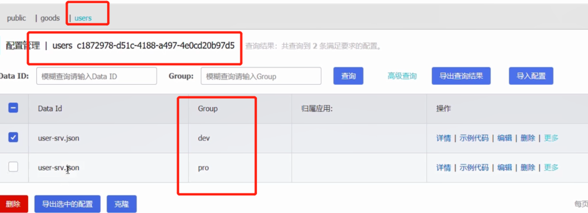
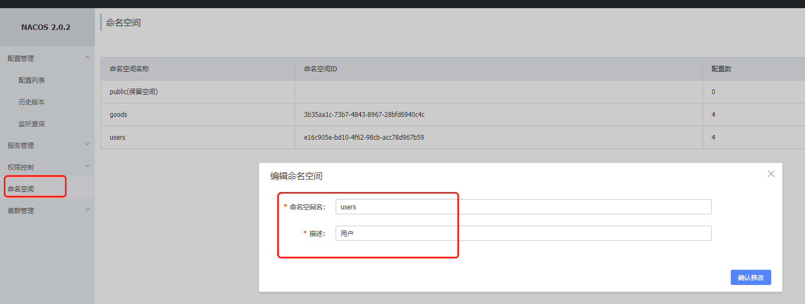
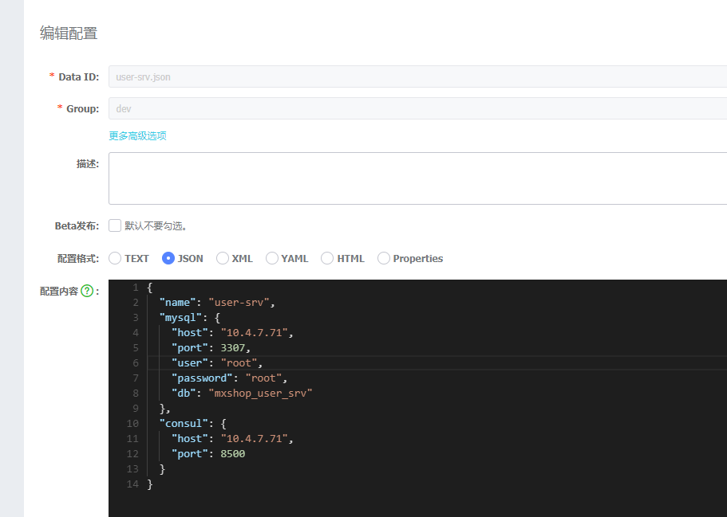

# 官方

https://nacos.io/zh-cn/


# 安装

```shell
docker run --name nacos-standalone -e MODE=standalone -e JVM_XMS=512m -e JVM_XMX=512m -e JVM_XMN=256m -p 8848:8848 -d nacos/nacos-server:latest
```

访问： http://10.4.7.71:8848/nacos/index.html

密码：nacos/nacos


# nacos概念简述

* 命名空间：隔离配置；比如用户，商品

* 配置集：一个完整的配置文件

* 组： 一组配置文件；比如本地、开发、测试、生产

 


# nacos api 使用

## 后台配置-案例

1） 添加命名空间

 


2）配置管理->新建配置

 

```json
{
  "name": "user-srv",
  "host": "10.4.7.71",
  "port": 50051,
  "tags": [
    "imooc",
    "user",
    "srv"
  ],
  "mysql": {
    "host": "10.4.7.71",
    "port": 3307,
    "user": "root",
    "password": "root",
    "db": "mxshop_user_srv"
  },
  "consul": {
    "host": "10.4.7.71",
    "port": 8500
  }
}
```


## golang 读取 ncaos配置

文档：https://github.com/nacos-group/nacos-sdk-go

### config/config.go

```go
package config

type MysqlConfig struct {
	Host     string `mapstructure:"host" json:"host"`
	Port     int    `mapstructure:"port" json:"port"`
	Name     string `mapstructure:"db" json:"db"`
	User     string `mapstructure:"user" json:"user"`
	Password string `mapstructure:"password" json:"password"`
}

type ConsulConfig struct {
	Host string `mapstructure:"host" json:"host"`
	Port int    `mapstructure:"port" json:"port"`
}

type ServerConfig struct {
	Host string   `mapstructure:"host"`
	Port uint64   `mapstructure:"port"`
	Tags []string `mapstructure:"tags" json:"tags"`
	Name string   `mapstructure:"name" json:"name"`

	MysqlInfo  MysqlConfig  `mapstructure:"mysql" json:"mysql"`
	ConsulInfo ConsulConfig `mapstructure:"consul" json:"consul"`
}

```


### main.go

```go
package main

import (
	"encoding/json"
	"fmt"

	"github.com/nacos-group/nacos-sdk-go/clients"
	"github.com/nacos-group/nacos-sdk-go/common/constant"
	"github.com/nacos-group/nacos-sdk-go/vo"

	"go-micro-frame-doc/08-nacos/01-golang-nacos-api/config"
)

func main() {
	sc := []constant.ServerConfig{
		{
			IpAddr: "10.4.7.71",
			Port:   8848,
		},
	}

	cc := constant.ClientConfig{
		NamespaceId:         "e16c905e-bd10-4f62-98cb-acc78d967b59", // 如果需要支持多namespace，我们可以场景多个client,它们有不同的NamespaceId
		TimeoutMs:           5000,
		NotLoadCacheAtStart: true,
		LogDir:              "tmp/nacos/log",
		CacheDir:            "tmp/nacos/cache",
		RotateTime:          "1h",
		MaxAge:              3,
		LogLevel:            "debug",
	}

	configClient, err := clients.CreateConfigClient(map[string]interface{}{
		"serverConfigs": sc,
		"clientConfig":  cc,
	})
	if err != nil {
		panic(err)
	}

	content, err := configClient.GetConfig(vo.ConfigParam{
		DataId: "user-dev-local.json",
		Group:  "dev"})

	if err != nil {
		panic(err)
	}
	//fmt.Println(content) //字符串 - yaml
	serverConfig := config.ServerConfig{}
	//想要将一个json字符串转换成struct，需要去设置这个struct的tag
	json.Unmarshal([]byte(content), &serverConfig)
	fmt.Println(serverConfig)

	//err = configClient.ListenConfig(vo.ConfigParam{
	//	DataId: "user-web.json",
	//	Group:  "dev",
	//	OnChange: func(namespace, group, dataId, data string) {
	//		fmt.Println("配置文件变化")
	//		fmt.Println("group:" + group + ", dataId:" + dataId + ", data:" + data)
	//	},
	//})
	//time.Sleep(3000 * time.Second)

}

```


# grpc 集成 nacos

## 思路

> 1）nacos 后台配置
>
> 2）grpc项目搭建
>
> 3）config-debug.yaml 配置 nacos连接
>
> 4）config/config.go 解析 config-debug.yaml 中的 nacos 配置信息
>
> 5）initialize/config.go 中，关于配置部分，把之前从 yaml读取的，改造成从 nacos 读取
>
> 6）global/global.go 增加 NacosConfig 全局变量

## nacos后台，增加配置

```json
{
  "name": "user-srv",
  "host": "10.4.7.71",
  "port": 50051,
  "tags": [
    "imooc",
    "user",
    "srv"
  ],
  "mysql": {
    "host": "10.4.7.71",
    "port": 3307,
    "user": "root",
    "password": "root",
    "db": "mxshop_user_srv"
  },
  "consul": {
    "host": "10.4.7.71",
    "port": 8500
  }
}
```


## 项目准备

这里使用的项目，参考使用 06-consul章节。可以直接完整拷贝进行改造


## config-debug.yaml

```yaml
host: '10.4.7.71'
port: 8848
namespace: 'e16c905e-bd10-4f62-98cb-acc78d967b59'
user: 'nacos'
password: 'nacos'
dataid: 'user-srv.json'
group: 'dev'
```

配置说明

> ```
> host: '10.4.7.71'		# nacos地址
> port: 8848		# nacos 端口
> namespace: 'e16c905e-bd10-4f62-98cb-acc78d967b59'	# 命名空间标记值
> user: 'nacos'		# nacos 用户名
> password: 'nacos'	# nacos 密码
> dataid: 'user-srv.json'		# 命名空间下的配置 data id
> group: 'dev'		# 命名空间下的配置的 group
> ```

config-pro.yaml

```yaml
host: '10.4.7.71'
port: 8848
namespace: 'e16c905e-bd10-4f62-98cb-acc78d967b59'
user: 'nacos'
password: 'nacos'
dataid: 'user-srv.json'
group: 'pro'
```


## global/global.go

```go
package global

var (
	DB *gorm.DB
	ServerConfig config.ServerConfig
	NacosConfig config.NacosConfig
)
```


## config/config.go

```go
type NacosConfig struct {
	Host      string `mapstructure:"host"`
	Port      uint64 `mapstructure:"port"`
	Namespace string `mapstructure:"namespace"`
	User      string `mapstructure:"user"`
	Password  string `mapstructure:"password"`
	DataId    string `mapstructure:"dataid"`
	Group     string `mapstructure:"group"`
}
```


## initialize/config.go

```go
package initialize

import (
	"encoding/json"
	"fmt"

	"github.com/nacos-group/nacos-sdk-go/clients"
	"github.com/nacos-group/nacos-sdk-go/common/constant"
	"github.com/nacos-group/nacos-sdk-go/vo"
	"github.com/spf13/viper"
	"go.uber.org/zap"

	"go-micro-frame-doc/08-nacos/02-grpc-nacos/global"
)

// 读取环境变量的配置
func GetEnvInfo(env string) bool {
	viper.AutomaticEnv()
	return viper.GetBool(env)
}

func InitConfig() {
	debug := GetEnvInfo("MXSHOP_DEBUG")
	configFilePrefix := "config"
	configFileName := fmt.Sprintf("08-nacos/02-grpc-nacos/%s-prod.yaml", configFilePrefix)
	if debug {
		configFileName = fmt.Sprintf("08-nacos/02-grpc-nacos/%s-dev.yaml", configFilePrefix)
	}

	// 读取文件配置内容
	v := viper.New()
	v.SetConfigFile(configFileName)
	if err := v.ReadInConfig(); err != nil {
		panic(err)
	}

	////////////////////////////////
	// 从 nacos 中读取配置

	// 把内容设置到全局变量的 NacosConfig
	if err := v.Unmarshal(&global.NacosConfig); err != nil {
		panic(err)
	}

	//从nacos中读取配置信息
	sc := []constant.ServerConfig{
		{
			IpAddr: global.NacosConfig.Host,
			Port:   global.NacosConfig.Port,
		},
	}
	cc := constant.ClientConfig{
		NamespaceId:         global.NacosConfig.Namespace, // 如果需要支持多namespace，我们可以场景多个client,它们有不同的NamespaceId
		TimeoutMs:           5000,
		NotLoadCacheAtStart: true,
		LogDir:              "tmp/nacos/log",
		CacheDir:            "tmp/nacos/cache",
		RotateTime:          "1h",
		MaxAge:              3,
		LogLevel:            "debug",
	}
	configClient, err := clients.CreateConfigClient(map[string]interface{}{
		"serverConfigs": sc,
		"clientConfig":  cc,
	})
	if err != nil {
		panic(err)
	}

	content, err := configClient.GetConfig(vo.ConfigParam{
		DataId: global.NacosConfig.DataId,
		Group:  global.NacosConfig.Group})

	if err != nil {
		panic(err)
	}
	//想要将一个json字符串转换成struct，需要去设置这个struct的tag
	err = json.Unmarshal([]byte(content), &global.ServerConfig)
	if err != nil {
		zap.S().Fatalf("读取nacos配置失败： %s", err.Error())
	}

	// 监听 nacos 配置变化
	err = configClient.ListenConfig(vo.ConfigParam{
		DataId: global.NacosConfig.DataId,
		Group:  global.NacosConfig.Group,
		OnChange: func(namespace, group, dataId, data string) {
			// todo, 这里能获取到 nacos 变化的值，但是没能赋值到 ServerConfig中
			fmt.Println("nacos中的配置", data)
			err = json.Unmarshal([]byte(data), &global.ServerConfig)
			if err != nil {
				zap.S().Errorf("配置中心文件改变后，解析 Json失败")
			}
			zap.S().Infof("nacos 改变后配置：", &global.ServerConfig)
		},
	})
	if err != nil {
		zap.S().Errorf("配置中心文件变化，解析失败!")
	}

	zap.S().Infof("从nacos读取到的全部配置如下：", &global.ServerConfig)
	////////////////////////////////
}

```


## test

启动 main.go

```shell
go run 08-nacos/02-grpc-nacos/main.go
```

