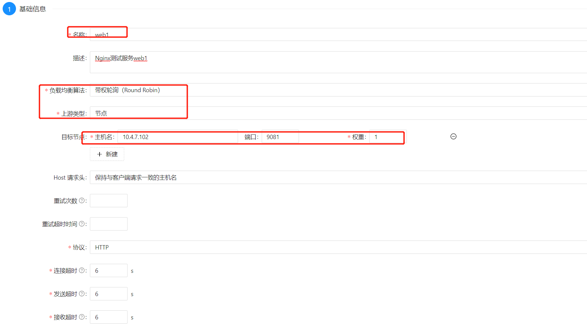
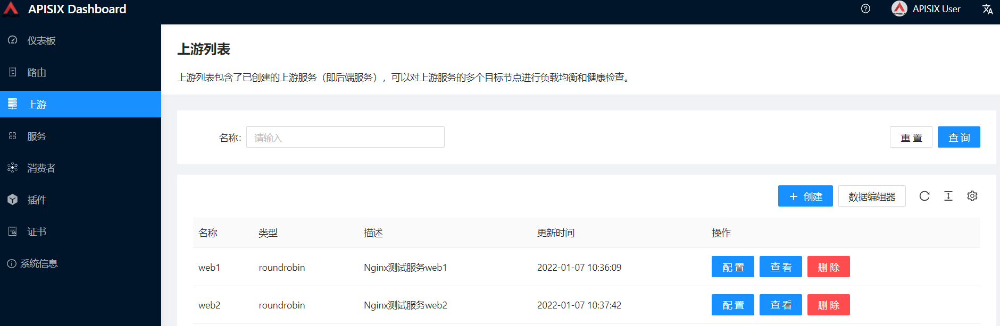
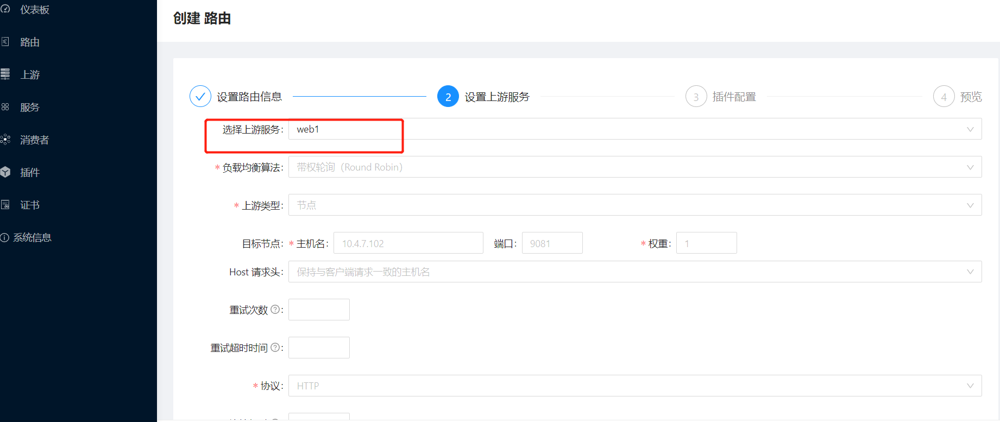
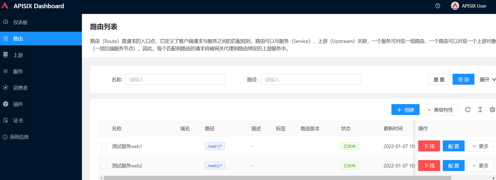

# 官方

文档：https://apisix.apache.org/zh/docs/apisix/getting-started/


# 安装

安装文档：

apisix/docs/zh/latest/how-to-build.md

## RPM包

### 安装 OpenResty

```shell
# 安装 OpenResty 的 YUM 软件源
$ yum install yum-utils
$ yum-config-manager --add-repo https://openresty.org/package/centos/openresty.repo

# 安装 OpenResty 软件
$ yum install -y openresty 
```


### 安装 etcd

```shell
# 安装 etcd
$ yum install -y etcd

# 启动 etcd
$ service etcd start
```


### 安装 APISIX

```shell
$ sudo yum install -y https://repos.apiseven.com/packages/centos/7/x86_64/apisix-2.11.0-0.el7.x86_64.rpm

# 启动 APISIX
$ apisix start

# 此时，APISIX 安装在 /usr/local/apisix/ 目录，使用如下命令：
$ cd /usr/local/apisix/
$ ls -ls
total 40
4 drwxr-xr-x 8 root   root 4096 May  1 20:40 apisix # APISIX 程序
4 drwx------ 2 nobody root 4096 May  1 20:44 client_body_temp
4 drwxr-xr-x 3 root   root 4096 May  1 20:50 conf # 配置文件
4 drwxr-xr-x 6 root   root 4096 May  1 20:40 dashboard # APISIX 控制台
4 drwxr-xr-x 5 root   root 4096 May  1 20:40 deps
4 drwx------ 2 nobody root 4096 May  1 20:44 fastcgi_temp
4 drwxrwxr-x 2 root   root 4096 May  1 20:44 logs # 日志文件
4 drwx------ 2 nobody root 4096 May  1 20:44 proxy_temp
4 drwx------ 2 nobody root 4096 May  1 20:44 scgi_temp
4 drwx------ 2 nobody root 4096 May  1 20:44 uwsgi_temp
```

默认情况下，APISIX 启动在 **9080** 端口，使用如下命令：

```shell
$ curl http://127.0.0.1:9080/
{"error_msg":"failed to match any routes"}
```


## docker方式安装

下载地址：https://github.com/apache/apisix-docker

```shell
git clone git@github.com:apache/apisix-docker.git
```

把`example`目录上传到Linux服务器上去，目录里面介绍

```shell
drwxrwxrwx. 2 root root   25 Jun 19 10:12 apisix_conf   # apisix配置文件目录
drwxrwxrwx. 2 root root   71 Jun 24 09:36 apisix_log    # apisix日志文件目录
drwxrwxrwx. 2 root root   23 Jun 23 17:10 dashboard_conf  # 可视化工具apisix-dashboard配置文件目录
-rwxrwxrwx. 1 root root 1304 Jun 19 10:12 docker-compose-alpine.yml # docker-compose 部署脚本（alpine）版本
-rwxrwxrwx. 1 root root 1453 Jun 19 10:12 docker-compose.yml # docker-compose 部署脚本
drwxrwxrwx. 2 root root   27 Jun 19 10:12 etcd_conf # ectd配置文件目录
drwxrwxrwx. 3 root root   31 Jun 23 17:06 etcd_data # ectd数据目录
drwxrwxrwx. 2 root root  107 Jun 19 10:12 mkcert
drwxrwxrwx. 2 root root   40 Jun 19 10:12 upstream # 两个测试用的Nginx服务配置
```

从`docker-compose.yml`中我们可以发现，该脚本不仅启动了apisix、apisix-dashboard、etcd这三个核心服务，还启动了两个测试用的Nginx服务；

```yaml
version: "3"

services:
  # 可视化管理工具apisix-dashboard
  apisix-dashboard:
    image: apache/apisix-dashboard:2.7
    restart: always
    volumes:
    - ./dashboard_conf/conf.yaml:/usr/local/apisix-dashboard/conf/conf.yaml
    ports:
    - "9000:9000"
    networks:
      apisix:

  # 网关apisix
  apisix:
    image: apache/apisix:2.6-alpine
    restart: always
    volumes:
      - ./apisix_log:/usr/local/apisix/logs
      - ./apisix_conf/config.yaml:/usr/local/apisix/conf/config.yaml:ro
    depends_on:
      - etcd
    ##network_mode: host
    ports:
      - "9080:9080/tcp"
      - "9443:9443/tcp"
    networks:
      apisix:

  # apisix配置数据存储etcd
  etcd:
    image: bitnami/etcd:3.4.15
    user: root
    restart: always
    volumes:
      - ./etcd_data:/bitnami/etcd
    environment:
      ETCD_ENABLE_V2: "true"
      ALLOW_NONE_AUTHENTICATION: "yes"
      ETCD_ADVERTISE_CLIENT_URLS: "http://0.0.0.0:2379"
      ETCD_LISTEN_CLIENT_URLS: "http://0.0.0.0:2379"
    ports:
      - "2379:2379/tcp"
    networks:
      apisix:

  # 测试用nginx服务web1，调用返回 hello web1
  web1:
    image: nginx:1.19.0-alpine
    restart: always
    volumes:
      - ./upstream/web1.conf:/etc/nginx/nginx.conf
    ports:
      - "9081:80/tcp"
    environment:
      - NGINX_PORT=80
    networks:
      apisix:

  # 测试用nginx服务web2，调用返回 hello web2
  web2:
    image: nginx:1.19.0-alpine
    restart: always
    volumes:
      - ./upstream/web2.conf:/etc/nginx/nginx.conf
    ports:
      - "9082:80/tcp"
    environment:
      - NGINX_PORT=80
    networks:
      apisix:

networks:
  apisix:
    driver: bridge
```

在`docker-compose.yml`文件所在目录下，使用如下命令可以一次性启动所有服务

```shell
$ docker-compose -p apisix-docker up -d
```

启动成功后，使用如下命令可查看所有服务的运行状态

```shell
$ docker-compose -p apisix-docker ps
              Name                            Command               State                                         Ports
--------------------------------------------------------------------------------------------------------------------------------------------------------------
apisix-docker_apisix-dashboard_1   /usr/local/apisix-dashboar ...   Up      0.0.0.0:9000->9000/tcp
apisix-docker_apisix_1             sh -c /usr/bin/apisix init ...   Up      0.0.0.0:9080->9080/tcp, 0.0.0.0:9091->9091/tcp, 0.0.0.0:9092->9092/tcp,
                                                                            0.0.0.0:9443->9443/tcp
apisix-docker_etcd_1               /opt/bitnami/scripts/etcd/ ...   Up      0.0.0.0:2379->2379/tcp, 2380/tcp
apisix-docker_grafana_1            /run.sh                          Up      0.0.0.0:3000->3000/tcp
apisix-docker_prometheus_1         /bin/prometheus --config.f ...   Up      0.0.0.0:9090->9090/tcp
apisix-docker_web1_1               /docker-entrypoint.sh ngin ...   Up      0.0.0.0:9081->80/tcp
apisix-docker_web2_1               /docker-entrypoint.sh ngin ...   Up      0.0.0.0:9082->80/tcp
```

接下来就可以通过可视化工具来管理apisix了，登录账号密码为`admin:admin`，访问地址：http://10.4.7.102:9000

- 还有两个测试服务，`web1`访问地址：http://10.4.7.102:9081
- 另一个测试服务`web2`访问地址：http://10.4.7.102:9082

# 案例使用

## 路由转发

之前已经启动了两个Nginx测试服务`web1`和`web2`，接下来我们将通过apisix的路由功能来访问它们。

### 上游Upstream

首先我们需要创建上游（Upstream），上游相当于虚拟主机的概念，可以对真实的服务提供负载均衡功能；

- 创建`web1`的上游，设置好名称、负载均衡算法和目标节点信息；

  

* 再按照上述方法创建`web2`的上游，创建完成后上游列表显示如下

  


### 路由Route

再创建`web1`的路由（Route），路由可以用于匹配客户端的请求，然后转发到上游

 

再选择好路由的上游为`web1`



接下来选择需要应用到路由上的插件，apisix的插件非常丰富，多达三十种，作为基本使用，我们暂时不选插件；


再创建`web2`的路由，创建完成后路由列表显示如下

 

- 接下来我们通过apisix网关访问下`web1`服务：http://10.4.7.102:9080/web1/
- 接下来我们通过apisix网关访问下`web2`服务：http://10.4.7.102:9080/web2/


## jwt


## 限流

## 跨域


# go-plugin

## 核心步骤

1）apisix-go-plugin-runner

```
git clone git@github.com:apache/apisix-go-plugin-runner.git
cd apisix-go-plugin-runner
make build
```

2）配置apisix

```shell
$ vim /path/to/apisix-go-plugin-runner/conf/config.yaml

apisix:
  admin_key:
    - name: admin
      key: edd1c9f034335f136f87ad84b625c8f1
      role: admin
ext-plugin:
  cmd: ["/path/to/apisix-go-plugin-runner/go-runner", "run"]
    
# 启动apisix    
$ cd /path/to/apisix
$ sudo ./bin/apisix [start | restart]
```

3） 检查apache apisix & go runner

```bash
# check go plugin runner
$ ps -ef | grep nginx

$ pstree -Up | grep openresty
```


## 结合限流插件

案例：结合限流插件梳理Go插件开发流程

文档：https://apisix.apache.org/docs/go-plugin-runner/getting-started/

### apisix配置

拉取 apisix的代码，在 apisix/conf/config.yaml 中配置

```yaml
apisix:
  admin_key:
    - name: admin
      key: edd1c9f034335f136f87ad84b625c8f1
      role: admin
ext-plugin:
  cmd: ["/srv/github.com/apache/apisix-go-plugin-runner/go-runner", "run"]
```


### apisix-go-plugin

拉取apisix-go-plugin-runner代码

> apisix-go-plugin的插件开发代码目录都是在：cmd/go-runner/plugins/目录下

步骤如下：

a.定义一个类对象

  ```go
  type LimitReq struct {
  }
  ```

b.实现plugin interface的方法

```go
func (p *LimitReq) Name() string {}
func (p *Say) ParseConf(in []byte) (interface{}, error) {}
func (p *Say) Filter(conf interface{}, w http.ResponseWriter, r pkgHTTP.Request) {}
```

c.插件对象注册到插件列表中

```go
func init() {
	err := plugin.RegisterPlugin(&LimitReq{})
	if err != nil {
		log.Fatalf("failed to register plugin limit-req: %s", err)
	}
}
```

d.配置使用


### 编译和运行

a. 编译 apisix-go-plugin:   make build

b. 启动 apisix: ./bin/apisix start


### apisix加入路由

```shell
curl http://127.0.0.1:9080/apisix/admin/routes/1 -H 'X-API-KEY: edd1c9f034335f136f87ad84b625c8f1' -X PUT -d '
{
  "uri": "/get",
  "plugins": {
    "ext-plugin-pre-req": {
      "conf": [
        { "name": "say", "value":"{\"body\":\"hello\"}"}
      ]
    }
  },
  "upstream": {
        "type": "roundrobin",
        "nodes": {
            "127.0.0.1:1980": 1
        }
    }
}
'
```

请求路由测试

```shell
curl http://127.0.0.1:9080/get
```


# 封装api

admin key

在下面出现的 `X-API-KEY` 指的是 `conf/config.yaml` 文件中的 `apisix.admin_key.key`，它是 Admin API 的访问 token


```
// 官方文档
// https://apisix.apache.org/zh/docs/apisix/admin-api/
// https://apisix.apache.org/zh/docs/apisix/plugins/limit-req
// https://apisix.apache.org/zh/docs/apisix/plugins/api-breaker/
```


