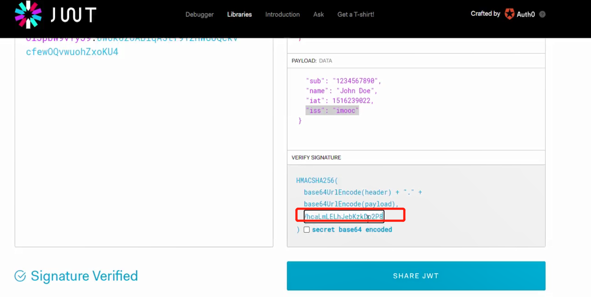

# 网关

## kong

https://github.com/kong/kong


https://github.com/qianyugang/kong-docs-cn


### 安装

```shell
# 安装 postgresql 和 migrations
docker run -d --name kong-database \
           -p 5432:5432 \
           -e "POSTGRES_USER=kong" \
           -e "POSTGRES_DB=kong" \
           -e "POSTGRES_PASSWORD=kong" \
           postgres:12
 
 ## 运行临时Kong容器迁移数据库
docker run --rm \
    -e "KONG_DATABASE=postgres" \
    -e "KONG_PG_HOST=10.4.7.71" \
    -e "KONG_PG_PASSWORD=kong" \
    -e "POSTGRES_USER=kong" \
    -e "KONG_CASSANDRA_CONTACT_POINTS=kong-database" \
    kong kong migrations bootstrap

# 安装kong
# 下载参考：https://docs.konghq.com/install/centos/
curl -Lo kong-2.5.0.amd64.rpm $( rpm --eval "https://download.konghq.com/gateway-2.x-centos-%{centos_ver}/Packages/k/kong-2.5.0.el%{centos_ver}.amd64.rpm")
$ sudo yum install kong-2.5.0.amd64.rpm -y

# 编辑kong配置
systemctl stop firewalld
##systemctl restart docker

cp /etc/kong/kong.conf.default /etc/kong/kong.conf
vim /etc/kong/kong.conf
## 修改如下内容
database = postgres
pg_host = 10.4.7.71 ## 配置服务器的ip，不是127.0.0.1
pg_port = 5432
pg_timeout = 5000
pg_user = kong
pg_password = kong

dns_resolver = 10.4.7.71:8600 ## 这个配置很重要，配置的是consul的dns端口，默认是8600
admin_listen = 0.0.0.0:8001 reuseport backlog=16384, 0.0.0.0:8444 http2 ssl reuseport backlog=16384
proxy_listen = 0.0.0.0:8000 reuseport backlog=16384, 0.0.0.0:8443 http2 ssl reuseport backlog=16384

# 启动kong
kong migrations bootstrap up -c /etc/kong/kong.conf # 这里是初始化生成数据库
kong start -c /etc/kong/kong.conf

## 添加防火墙规则
firewall-cmd --zone=public --add-port=8001/tcp --permanent
firewall-cmd --zone=public --add-port=8000/tcp --permanent
sudo firewall-cmd --reload

## 浏览器访问，下面能访问正常就是OK
http://10.4.7.71:8001

# 安装konga， 图形化工具
docker run -d -p 1337:1337 --name konga pantsel/konga
```

8001: kong的管理端口

8000: 用户访问

1337: konga 地址


上面 kong/kong.conf 里的 dns_resolver 配置是 consul,

如果是 nacos，需要额外安装，参考; https://github.com/nacos-group/nacos-coredns-plugin

已经封装在 nacos-coredns模块


### 基本的路由转发配置

​		service服务是一个抽象服务层，可以用于指向具体物理服务（target），也可以指向upstream用于实现物理服务的负载效果。一个service对于upstream、target都是一对一的关系。

​		routes路由匹配客户端的请求规则。匹配成功后分配到service层。一个路由指向一个service，一个service可以被多个不通规则的路由routes指向。相当于nginx配置中的 location

​		upstream主要用于实现kong的负载功能，一个service匹配到一个upstream后，upstream可以指向多个target服务以此来实现负载的效果。

​		target服务端指的就是最后的物理服务，当然也可以是其他的虚拟服务。


1) 增加一个配置

services -> add-service

 

给 goods-web增加 routes

 


浏览器访问： 10.4.7.71:8000/g/v1/goods


### kong集成consul实现服务发现和负载均衡

 查看info中，是否有成功配置好 dns_server信息；


10.4.7.71:8000/g/v1/goods


### kong 配置jwt实现登录校验

1) 创建 consumers

2) 为这个 consumer 配置 jwt

3) 记住内容中的 key

4) 配置全局的 plugin

4.1 ) 设置全局的token plugin -> add plugin -> jwt -> header names : x-token

注意：这里的 key, secret 要和代码中已经存在的 Jwt 配置保持一致。否则kong的jwt通过认证了，代码中的jwt还没有通过；

实际开发中，可以只用 kong中的jwt；然后用（4.2）中的方式，生成token；也可以写一个接口给到前端调取生成token

 

4.2) jwt.io生成 token

 

 

上面这个 secret 从 konga的管理后台里选择；


### kong配置反爬和ip黑名单

plugins -> security

ip 限制

plugins -> security->ip restriction

 


ip反爬

plugins -> security->bot detection

 


