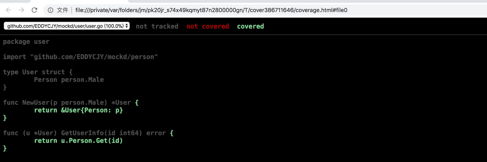

# gomock

## 安装

```
go get github.com/golang/mock/gomock
go get github.com/golang/mock/mockgen
```

1.第一步：我们将安装 gomock 第三方库和 mock 代码的生成工具 mockgen。而后者可以大大的节省我们的工作量。只需要了解其使用方式就可以

2.第二步：输入 `mockgen` 验证代码生成工具是否安装正确。若无法正常响应，请检查 `bin` 目录下是否包含该二进制文件


## 用法

在 `mockgen` 命令中，支持两种生成模式：

1.source：从源文件生成 mock 接口（通过 -source 启用）

```
mockgen -source=foo.go [other options]
```

2.reflect：通过使用反射程序来生成 mock 接口。它通过传递两个非标志参数来启用：导入路径和逗号分隔的接口列表

```shell
mockgen database/sql/driver Conn,Driver
```

从本质上来讲，两种方式生成的 mock 代码并没有什么区别。因此选择合适的就可以了


## 案例

### 案例代码讲解

完整代码参考：01-project-mock

```go
package person

//go:generate mockgen -source=male.go -destination=../mock/male_mock.go -package=mock
type Male interface {
	Get(id int64) error
}
```

命令说明

* -source：设置需要模拟（mock）的接口文件

* -destination：设置 mock 文件输出的地方，若不设置则打印到标准输出中

* -package：设置 mock 文件的包名，若不设置则为 `mock_` 前缀加上文件名（如本文的包名会为 mock_person）

想了解更多的指令符，可参见 [官方文档](https://github.com/golang/mock#running-mockgen)

执行上面的命令，会生成 mock文件；


**编写测试文件**

```go
package user

import (
	"testing"

	"github.com/golang/mock/gomock"
	"go-micro-frame-doc/24-gomock/01-project-mock/mock"
)

func TestUser_GetUserInfo(t *testing.T) {
	ctl := gomock.NewController(t)
	defer ctl.Finish()

	var id int64 = 1
	mockMale := mock.NewMockMale(ctl)
	gomock.InOrder(
		mockMale.EXPECT().Get(id).Return(nil),
	)

	user := NewUser(mockMale)
	err := user.GetUserInfo(id)
	if err != nil {
		t.Errorf("user.GetUserInfo err: %v", err)
	}
}
```

1.gomock.NewController：返回 `gomock.Controller`，它代表 mock 生态系统中的顶级控件。定义了 mock 对象的范围、生命周期和期待值。另外它在多个 goroutine 中是安全的

2.mock.NewMockMale：创建一个新的 mock 实例

3.gomock.InOrder：声明给定的调用应按顺序进行（是对 gomock.After 的二次封装）

4.mockMale.EXPECT().Get(id).Return(nil)：这里有三个步骤，`EXPECT()`返回一个允许调用者设置**期望**和**返回值**的对象。`Get(id)` 是设置入参并调用 mock 实例中的方法。`Return(nil)` 是设置先前调用的方法出参。简单来说，就是设置入参并调用，最后设置返回值

5.NewUser(mockMale)：创建 User 实例，值得注意的是，在这里**注入了 mock 对象**，因此实际在随后的 `user.GetUserInfo(id)` 调用（入参：id 为 1）中。它调用的是我们事先模拟好的 mock 方法

6.ctl.Finish()：进行 mock 用例的期望值断言，一般会使用 `defer` 延迟执行，以防止我们忘记这一操作


**测试**

回到项目根目录下,执行如下命令

```shell
24-gomock\01-project-mock> go test ./user
ok      go-micro-frame-doc/24-gomock/01-project-mock/user       0.495s
```

查看覆盖率

```shell
24-gomock\01-project-mock> go test -cover ./user
ok      go-micro-frame-doc/24-gomock/01-project-mock/user       0.414s  coverage: 100.0% of statements
```

可通过设置 `-cover` 标志符来开启覆盖率的统计，展示内容为 `coverage: 100.0%`。


**可视化界面**

生成测试覆盖率的 profile 文件

```
go test ./... -coverprofile=cover.out
```

利用 profile 文件生成可视化界面

```
go tool cover -html=cover.out
```

查看可视化界面，分析覆盖情况

 


### 常用Mock方法

#### 调用方法

- Call.Do()：声明在匹配时要运行的操作
- Call.DoAndReturn()：声明在匹配调用时要运行的操作，并且模拟返回该函数的返回值
- Call.MaxTimes()：设置最大的调用次数为 n 次
- Call.MinTimes()：设置最小的调用次数为 n 次
- Call.AnyTimes()：允许调用次数为 0 次或更多次
- Call.Times()：设置调用次数为 n 次

#### 参数匹配

- gomock.Any()：匹配任意值
- gomock.Eq()：通过反射匹配到指定的类型值，而不需要手动设置
- gomock.Nil()：返回 nil

建议更多的方法可参见 [官方文档](https://godoc.org/github.com/golang/mock/gomock#pkg-index)


### 生成多个mock文件

你可能会想一条条命令生成 mock 文件，岂不得崩溃？

当然，官方提供了更方便的方式，我们可以利用 `go:generate` 来完成批量处理的功能

```
go generate [-run regexp] [-n] [-v] [-x] [build flags] [file.go... | packages]
```


**修改 interface 方法**

打开 person/male.go 文件，修改为以下内容：

```go
package person

//go:generate mockgen -destination=../mock/male_mock.go -package=mock go-micro-frame-doc/24-gomock/01-project-mock/person Male
type Male interface {
    Get(id int64) error
}
```

我们关注到 `go:generate` 这条语句，可分为以下部分：

1. 1.声明 `//go:generate` （注意不要留空格）
2. 2.使用 `mockgen` 命令
3. 3.定义 `-destination`
4. 4.定义 `-package`
5. 5.定义 `source`，此处为 person 的包路径
6. 6.定义 `interfaces`，此处为 `Male`


重新生成mock,回到项目根目录下

```
go generate ./...
```

再检查 `mock/` 发现也已经正确生成了，在多个文件时很方便。